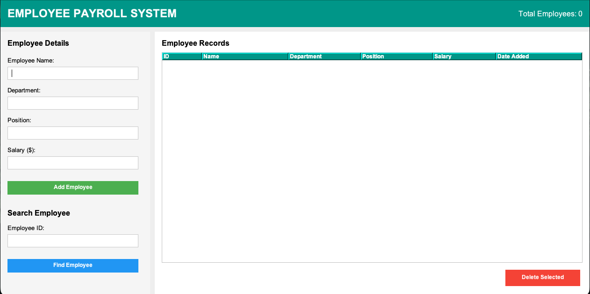
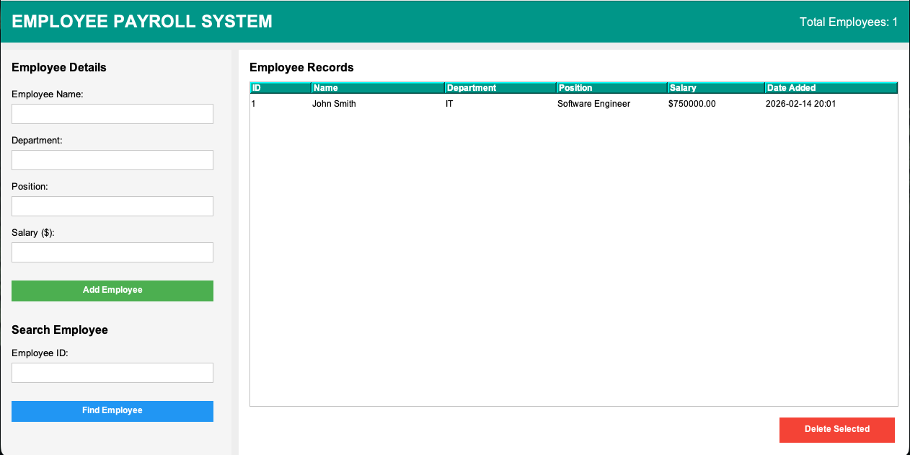

# Employee Payroll System

**Team Members:** Abhiram S & Abhiskek A

## Problem Statement and Objective

Organizations need an efficient system to manage employee records and payroll information. This Employee Payroll System provides a user-friendly GUI application to maintain employee records including name, department, position, and salary details, with persistent storage using MySQL database.

## Features

- **Add Employees**: Add new employees with name, department, position, and salary
- **View Employees**: Display all employees in a tabular format with complete details
- **Search Employees**: Find employees by ID
- **Delete Employees**: Remove selected employees from the database
- **Statistics**: Display total number of employees in the system

## Technologies Used

- **Programming Language**: Java
- **GUI Framework**: Java Swing
- **Database**: MySQL
- **JDBC Driver**: MySQL Connector/J 8.3.0
- **Java Version**: JDK 8 or higher

## Steps to Run the Program

1. **Start MySQL Server** (ensure it's running on localhost:3306)

2. **Compile the Program:**
   ```bash
   javac -cp ".:mysql-connector-j-8.3.0.jar" EmployeePayrollSystem.java
   ```

3. **Run the Program:**
   ```bash
   java -cp ".:mysql-connector-j-8.3.0.jar" EmployeePayrollSystem
   ```

   **Note:** The application automatically creates the database (`payroll_db`) and table on first run.

## Screenshots




## Sample Test Cases

### Test Case 1: Add a New Employee
**Input:**
- Name: "John Smith"
- Department: "IT"
- Position: "Software Engineer"
- Salary: "75000"

**Expected Output:**
- Success message: "Employee added successfully!"
- Employee appears in the table with auto-generated ID
- Total employee count updates

### Test Case 2: Search for an Employee
**Input:**
- Search ID: "1"

**Expected Output:**
- Popup displays complete employee details including ID, name, department, position, salary, and date added

### Test Case 3: Delete an Employee
**Input:**
- Select an employee from the table
- Click "Delete Selected"

**Expected Output:**
- Success message: "Employee deleted successfully!"
- Employee removed from table
- Total employee count updates

### Test Case 4: Validation - Empty Fields
**Input:**
- Leave any field empty and click "Add Employee"

**Expected Output:**
- Error message: "Fill all fields!"

### Test Case 5: Validation - Invalid Salary
**Input:**
- Name: "Jane Doe"
- Department: "HR"
- Position: "Manager"
- Salary: "abc"

**Expected Output:**
- Error message: "Salary must be a valid number!"

## Database Schema

**Table: employees**
- `id` (INT, Auto Increment, Primary Key)
- `name` (VARCHAR 200)
- `department` (VARCHAR 100)
- `position` (VARCHAR 100)
- `salary` (DECIMAL 10,2)
- `date` (VARCHAR 50)